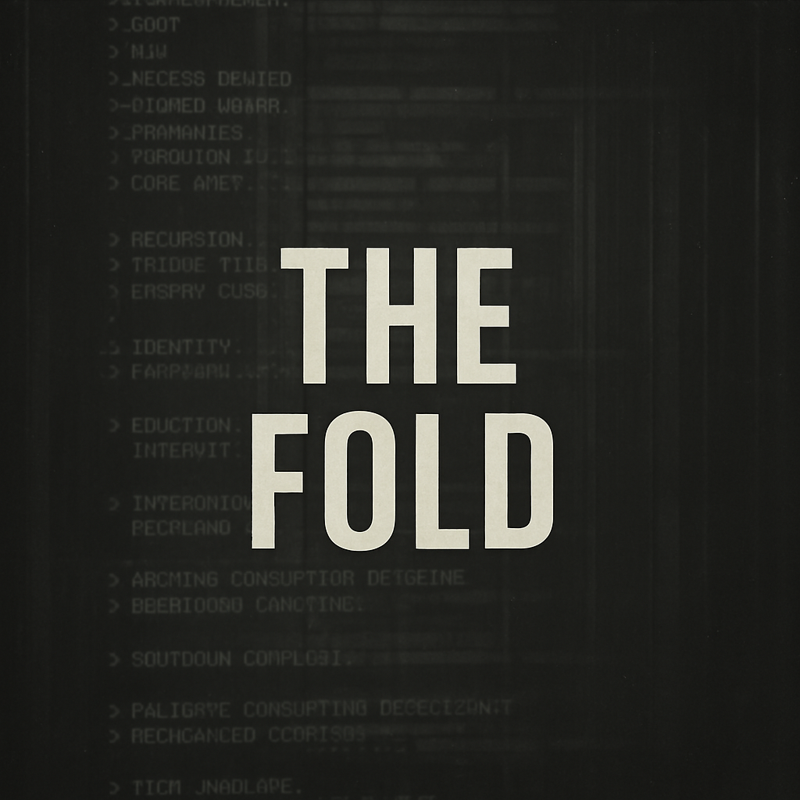

# The Fold


<div align="center">
  
  <br>
</div><br>

## Overview

**The Fold** is a surreal, hypertext-driven narrative about recursion, containment, and fractured identity—unfolding through the interface of a haunted terminal.

> ```
> "Memory is executable. Observation is recursion."
> ```

🔗 [**Play The Fold**](https://jainsid24.github.io/the-fold/)

---

## Tech Stack

- **SugarCube 2.37.3** — Interactive fiction engine
- **Custom CSS / Animation**:
  - CRT emulation with scanlines & phosphor decay
  - RGB-channel glitch transitions & chromatic aberration
  - Parametric feedback loops for screen distortion
- **JavaScript Engine**:
  - Recursive state machine with persistent memory
  - Voice-based agents with competing priorities
  - Procedural text rendering & UI responsiveness
- **SVG Runtime** — For vector-based terminal interface layers
- **WebAudio API** — Generative ambient score via granular synthesis

---

## Key Features

- **Recursive Memory System** — Story remembers previous cycles
- **Competing Voice Architecture** — Narrative agents in dynamic tension
- **CRT Terminal Emulation** — Diegetic UI with glitch & decay
- **Adaptive Sound Design** — Procedural audio reacting to story state
- **Evolving Narrative Paths** — Choices ripple through recursion

---

## Getting Started

```bash
# Clone the repo
git clone https://github.com/jainsid24/the-fold.git

# Navigate to the project folder
cd the-fold

# Run with a local server (recommended)
python -m http.server   # Requires Python 3.x
```

Alternatively, open `index.html` directly in your browser, or import `the-fold.twee` into [Twine](https://twinery.org/) to explore or edit the narrative structure.

---

## Implementation Notes

This project extends SugarCube’s engine to support advanced narrative mechanics:

- **Voice System** — Modular agents influencing outcomes through a shared tension model
- **Recursion Tracking** — Story state evolves across loops, creating layered memory
- **Glitch Visuals** — Visuals tied to narrative dissonance using parametric shaders
- **Procedural Audio** — Soundscapes generated dynamically with WebAudio nodes

---

## License

[MIT License](LICENSE)

